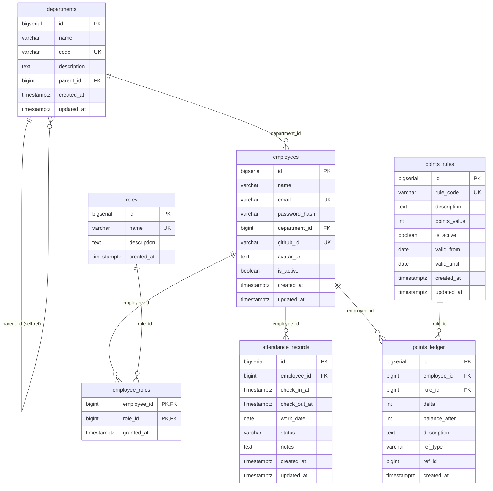

# points_core — Database Schema

> **Canonical reference** for the `points_core` PostgreSQL database.
> Managed by **Flyway** migrations in `points-mall-core/src/main/resources/db/migration/`.
> Do not edit table structures directly — always create a new `V{n}__` migration file.

---

## ER Diagram

---

## Table Descriptions

### `departments`
Organizational hierarchy. Supports unlimited nesting via `parent_id` self-reference.

### `employees`
Core user entity. `password_hash` is nullable to support OAuth-only accounts.
`github_id` is unique to prevent duplicate GitHub-linked accounts.

### `roles` + `employee_roles`
Many-to-many RBAC. Pre-seeded roles: `admin`, `employee`.
`employee_roles` is the junction table.

### `attendance_records`
One row per attendance event. `status` values: `normal | late | early_leave | absent`.
Indexed on `(employee_id, work_date)` for fast monthly queries.

### `points_rules`
Defines how points are earned or deducted. `points_value` is signed:
positive = earn, negative = deduct. `valid_from`/`valid_until` support time-limited rules.

### `points_ledger`
Append-only ledger. Every points change (earn or spend) adds one row.
`balance_after` is the running balance snapshot — allows fast current-balance lookup
without re-summing all rows. `ref_type` + `ref_id` trace the originating event.

---

## Migration Files

| File | Description |
|------|-------------|
| `V1__create_departments.sql` | Create `departments` table |
| `V2__create_employees.sql` | Create `employees` table |
| `V3__create_roles.sql` | Create `roles` + `employee_roles`, seed admin/employee roles |
| `V4__create_attendance_records.sql` | Create `attendance_records` table |
| `V5__create_points_rules.sql` | Create `points_rules` table |
| `V6__create_points_ledger.sql` | Create `points_ledger` table |
