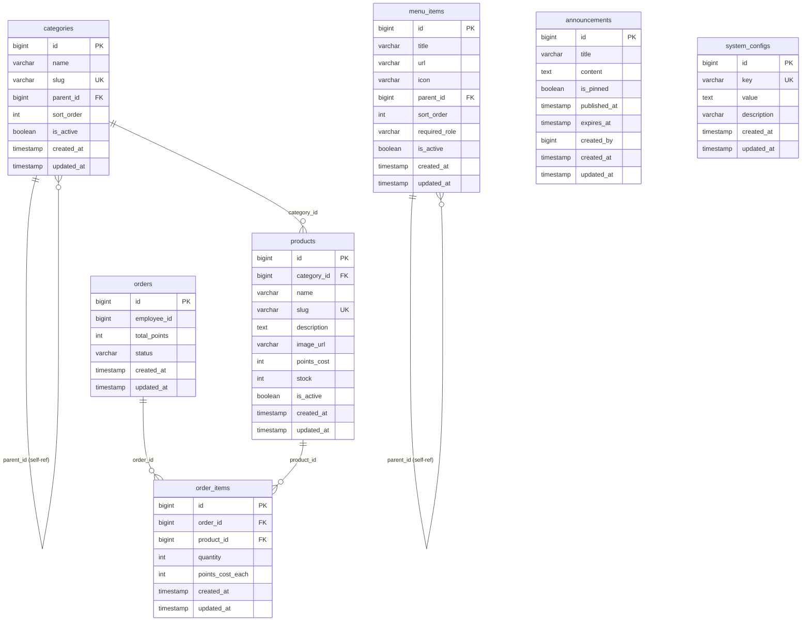

# points_shop — Database Schema

> **Canonical reference** for the `points_shop` PostgreSQL database.
> Managed by **Laravel migrations** in `points-mall-shop/database/migrations/`.
> Run `php artisan migrate` to apply. Never hand-edit production tables.

---

## ER Diagram

---

## Table Descriptions

### `categories`
Product taxonomy. Supports unlimited nesting via `parent_id` self-reference.
`slug` is URL-safe unique identifier used in frontend routing.

### `products`
Goods available for points exchange. `points_cost` is the redemption price.
`stock` tracks inventory; out-of-stock products should be de-listed (not deleted).

### `orders`
One order per redemption event. `employee_id` is a logical reference to `points_core.employees`
— no FK constraint because the tables live in different databases.
`status` lifecycle: `pending → paid → shipped → completed` (or `cancelled` at any step).

### `order_items`
Line items for an order. Snapshot `points_cost_each` at the time of purchase to preserve
historical pricing even if the product price changes later.

### `menu_items`
Navigation menu configuration stored in DB for runtime admin control.
`required_role` gates visibility (e.g. `admin`-only items).

### `announcements`
System-wide notices. `is_pinned` keeps high-priority items at the top.
`published_at` / `expires_at` control the display window.
`created_by` is a logical reference to `points_core.employees`.

### `system_configs`
Key-value store for runtime configuration (feature flags, thresholds, etc.).
`key` is unique; updates in place via `upsert`.

---

## Migration Files

| File | Description |
|------|-------------|
| `2026_06_23_000001_create_categories_table.php` | Create `categories` table |
| `2026_06_23_000002_create_products_table.php` | Create `products` table |
| `2026_06_23_000003_create_orders_table.php` | Create `orders` table |
| `2026_06_23_000004_create_order_items_table.php` | Create `order_items` table |
| `2026_06_23_000005_create_menu_items_table.php` | Create `menu_items` table |
| `2026_06_23_000006_create_announcements_table.php` | Create `announcements` table |
| `2026_06_23_000007_create_system_configs_table.php` | Create `system_configs` table |
